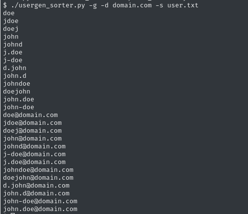

# usergen-sort
Generate usernames from human names and sort them by complexity order. Or just sort lists by complexity.



### Note:
This script was created for educational purposes only. 

### Usage
```bash
# Generate a list of usernames from names
usergen_sorter.py -g names.txt

# Generate a list of usernames from names and add domains.
usergen_sorter.py -g -d names.txt

# Just sort names by increasing complexity
usergen_sorter.py -s names.txt 

# Generate usernames, sort by increasing complexity and remove case insensitive duplicates
usergen_sorter.py -g -sdi names.txt

# Generate usernames with mails, sort by decreasing complexity and remove case sensitive duplicates.
usergen_sorter.py -g -d domain.com -sds -de names.txt
```

### Help
```bash
usage: usergen_sorter.py [-h] [-g] [-d DOMAIN] [-s] [-sds] [-sdi] [-de] [file]

Prepare list for user spraying.

positional arguments:
  file                  File with list to sort

options:
  -h, --help            show this help message and exit
  -g, --generate        Generate usernames from input
  -d, --domain DOMAIN   In case there is a domain. (only use with -g)
  -s, --sort            Sort by complexity
  -sds, --sort_dup_sen  Sort by complexity and remove duplicates case sensitive ('This != this')
  -sdi, --sort_dup_ins  Sort by complexity and remove duplicates case insensitive ('This == this')
  -de, --decreased      Sort by decreasing complexity
```

### Install
Just download the py script, read then use. 
Written for python3~ish. 


### Todo
- Add logic for more than first/last name.
- Think about adding scrapping capabilities. (Might become a real project)


